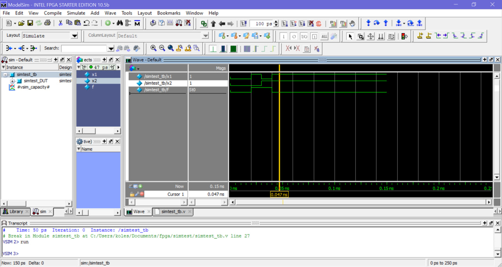
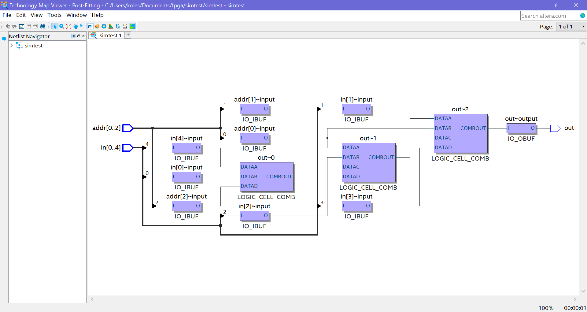
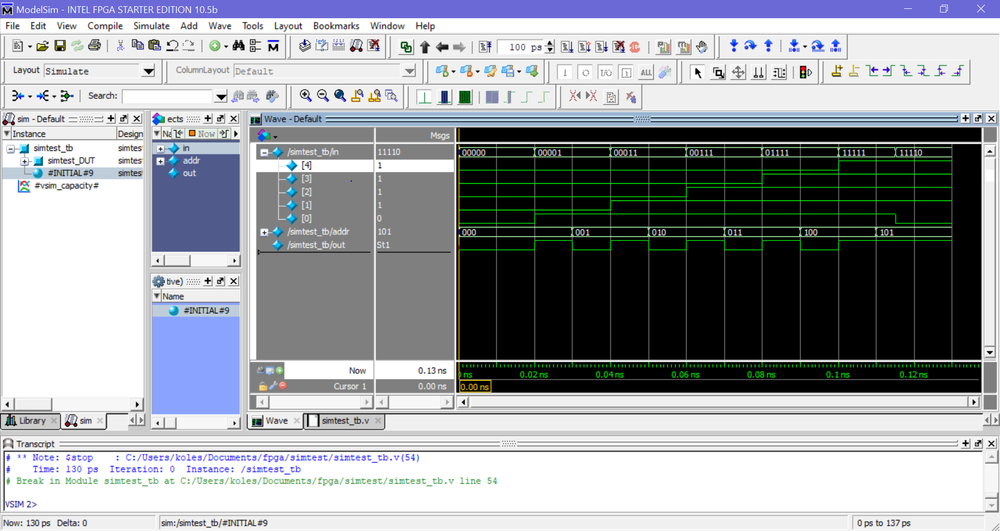
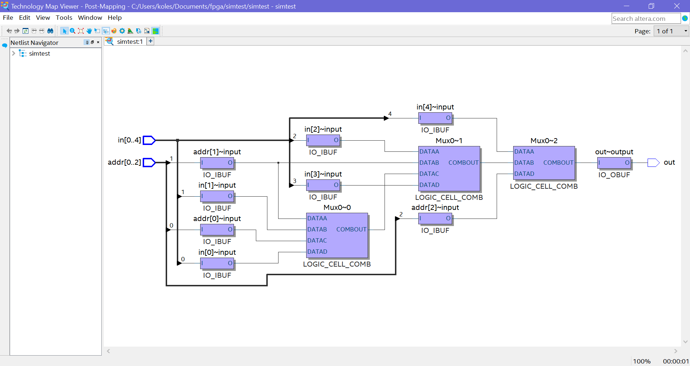

# Пример из PDF

Исследуемый модуль:

```verilog
module simtest (x1, x2, f);
input x1, x2;
output f;
assign f = (x1 & ~x2)|(~x1 & x2);
endmodule
```

Его testbench:

```verilog
module simtest_tb;

reg x1=0,x2=0;
wire f;  

simtest simtest_DUT (.x1(x1),.x2(x2),.f(f));

initial begin

#10
x1=0;
x2=0;

#10
x1=1;
x2 = 0;

#10
x1 = 0;
x2 = 1;

#10
x1 = 1;
x2 = 1;

#10
$stop;

end

endmodule
```

Результат симуляции



# Мультиплексор N=5

Исследуемый модуль:

```verilog
module simtest (in, addr, out);
// N = 5
// addr in
// 000  0
// 001  1
// 010  2
// 011  3
// 100  4
input wire [4:0] in;
input wire [2:0] addr;
output wire out;
assign out = addr[0]?(addr[1]?in[3]:in[1]):(addr[1]?in[2]:(addr[2]?in[4]:in[0]));
endmodule
```

Его testbench:

```verilog
module simtest_tb;

reg [4:0] in=0;
reg [2:0] addr=0;
wire out;

simtest simtest_DUT (.in(in),.addr(addr),.out(out));

initial begin

#10
addr = 3'b000;
#5
in[0] = 0;
#5
in[0] = 1;

#10
addr = 3'b001;
#5
in[1] = 0;
#5
in[1] = 1;

#10
addr = 3'b010;
#5
in[2] = 0;
#5
in[2] = 1;

#10
addr = 3'b011;
#5
in[3] = 0;
#5
in[3] = 1;

#10
addr = 3'b100;
#5
in[4] = 0;
#5
in[4] = 1;

#10
addr = 3'b101;
#5
in[0] = 0;
#5
in[1] = 1;

#10
$stop;

end

endmodule
```

Map viewer:



Результат симуляции:




# Мультиплексор N=5 с индексной адресацией

Исследуемый модуль:

```verilog
module simtest (in, addr, out);
// N = 5
// addr in
// 000  0
// 001  1
// 010  2
// 011  3
// 100  4
input wire [4:0] in;
input wire [2:0] addr;
output wire out;
assign out = in[addr];
endmodule
```

Testbench аналогичен мультиплексору выше.

Map viewer:



Результат симуляции:


Результат моделирования совпал с мультиплексором через тернарные операторы. Синтезированная схема в сущности одинакова (две 4х1 ячейки и одна 3х1 ячейка).